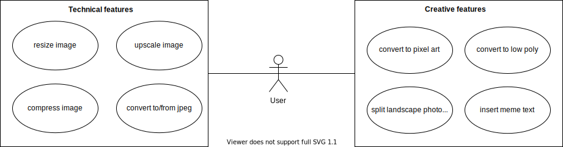

# Common Playground - Software Requirements Specification

## Table of contents

- [Common Playground - Software Requirements Specification](#common-playground---software-requirements-specification)
  - [Table of contents](#table-of-contents)
  - [1. Introduction](#1-introduction)
    - [1.1 Purpose](#11-purpose)
    - [1.2 Scope](#12-scope)
    - [1.3 Definitions, Acronyms and Abbreviations](#13-definitions-acronyms-and-abbreviations)
    - [1.4 References](#14-references)
    - [1.5 Overview](#15-overview)
  - [2. Overall Description](#2-overall-description)
    - [2.1 Vision](#21-vision)
    - [2.2 Use Case Diagram](#22-use-case-diagram)
    - [2.3 Technology Stack](#23-technology-stack)
  - [3. Specific Requirements](#3-specific-requirements)
    - [3.1 Functionality](#31-functionality)
      - [3.1.1 Posting a session](#311-posting-a-session)
      - [3.1.2 Getting an overview](#312-getting-an-overview)
      - [3.1.3 Creating an account](#313-creating-an-account)
      - [3.1.4 Logging in](#314-logging-in)
      - [3.1.5 Logging out](#315-logging-out)
      - [3.1.6 Joining a session](#316-joining-a-session)
      - [3.1.7 Keeping track of your sessions](#317-keeping-track-of-your-sessions)
      - [3.1.8 Leaving a session](#318-leaving-a-session)
      - [3.1.9 Finding a session](#319-finding-a-session)
      - [3.1.10 Getting in touch](#3110-getting-in-touch)
      - [3.1.11 Presenting yourself and checking out others](#3111-presenting-yourself-and-checking-out-others)
      - [3.1.12 Reporting users and managing friends](#3112-reporting-users-and-managing-friends)
      - [3.1.13 Banning users and deleting posts](#3113-banning-users-and-deleting-posts)
    - [3.2 Usability](#32-usability)
      - [3.2.1 No training time needed](#321-no-training-time-needed)
      - [3.2.2 Familiar Feeling](#322-familiar-feeling)
    - [3.3 Reliability](#33-reliability)
      - [3.3.1 Availability](#331-availability)
      - [3.3.2 Defect Rate](#332-defect-rate)
    - [3.4 Perfomance](#34-perfomance)
      - [3.4.1 Capacity](#341-capacity)
      - [3.4.2 Storage](#342-storage)
      - [3.4.3 App perfomance / Response time](#343-app-perfomance--response-time)
    - [3.5 Supportability](#35-supportability)
      - [3.5.1 Coding Standards](#351-coding-standards)
      - [3.5.2 Testing Strategy](#352-testing-strategy)
    - [3.6 Design Constraints](#36-design-constraints)
    - [3.7 On-line User Documentation and Help System Requirements](#37-on-line-user-documentation-and-help-system-requirements)
    - [3.8 Purchased Components](#38-purchased-components)
    - [3.9 Interfaces](#39-interfaces)
      - [3.9.1 User Interfaces](#391-user-interfaces)
      - [3.9.2 Hardware Interfaces](#392-hardware-interfaces)
      - [3.9.3 Software Interfaces](#393-software-interfaces)
      - [3.9.4 Communication Interfaces](#394-communication-interfaces)
    - [3.10 Licensing Requirements](#310-licensing-requirements)
    - [3.11 Legal, Copyright, and Other Notices](#311-legal-copyright-and-other-notices)
    - [3.12 Applicable Standards](#312-applicable-standards)
  - [4. Supporting Information](#4-supporting-information)

## 1. Introduction

### 1.1 Purpose

This Software Requirements Specification (SRS) describes all specifications for the application PiXS. It includes an overview about this project and its vision, detailed information about the planned features and boundary conditions of the development process.

### 1.2 Scope

The project is going to be realized as a web application (webapp).
Actors of this App can only be users. There are no additional actors.
The main idea of this project is to manipulate images in certain ways.
Planned features/manipulations are:

- resizing image:
  Adjusting an image's height and width to values given by the user.
- compressing images:
  Reducing an image's file size by implementing a lossy compression algorithm.
- split landscape photo into 1080 x 1080 Instagram format:
  A given Image in landscape format is split horizontally into Images with 1080 Pixels in width. The hight of the original image is reduced to 1080 Pixels. The output Images can be posted on Instagram as swipe throught.
- converting to jpeg/png:
  This converts a image to `JPEG` or `PNG` format. This works bidirectional.
- converting images to low poly art:
  This generates a low poly art out of a given image.
- convertint images to pixel art:
  This generates a pixel art out of a given image.
- insert meme text onto image:
  Add a subtitle to an image in a fast way. Hereby, the text is written in the `Impact` font.
- scale up images:
  Uses AI to increase a image's resolution.

### 1.3 Definitions, Acronyms and Abbreviations

| Abbrevation | Explanation                         |
| ----------- | ----------------------------------- |
| SRS         | Software Requirements Specification |
| UC          | Use Case                            |
| n/a         | not applicable                      |
| tbd         | to be determined                    |
| UCD         | Use Case Diagram                    |
| webapp      | Web Application                     |

### 1.4 References

| Title                                                                                                         |    Date    | Publishing organization |
| ------------------------------------------------------------------------------------------------------------- | :--------: | ----------------------- |
| [Common Playground Blog](http://commonplayground.wordpress.com)                                               | 19.10.2021 | PiXS Team               |
| [GitHub](https://github.com/se-pixs)                                                                          | 19.10.2021 | PiXS Team               |
| [SRS Template](https://github.com/nilskre/CommonPlayground/blob/pm/docs/SoftwareRequirementsSpecification.md) | 18.10.2018 | Common Playground Team  |

### 1.5 Overview

The following chapter provides an overview of this project with vision and overall UCD. The third chapter (Requirements Specification) delivers more details about the specific requirements in terms of functionality, usability and design parameters. Finally there is a chapter with supporting information.

## 2. Overall Description

### 2.1 Vision

The idea for this project is a result of missing tools in these fields of image manipulation. We wanted to build something which we could use ourselves. As it is sometimes laborious to resize images or convert them to other formats, we decided to build an own tool for common problems we had. This tool should be easy to use compared to other products. In the end, this application is a collection of problem solvers for the daily life when dealing with small image manipulations. Additionally, the goal of this project is to provide a software that's easily adaptable and where you can add new features quickly.

### 2.2 Use Case Diagram

### 2.3 Technology Stack

The technologies we use are:

Backend:

- Django with Python
- Anaconda as package manage

Frontend:

- ReactJS with Typescript
- Bootstrap
- SASS

IDE:

- Visual Studio Code

Project Management:

- YouTrack
- GitHub

## 3. Specific Requirements

Text

### 3.1 Functionality

Text

#### 3.1.1 Posting a session

Text

#### 3.1.2 Getting an overview

Text

#### 3.1.3 Creating an account

Text

#### 3.1.4 Logging in

Text

#### 3.1.5 Logging out

Text

#### 3.1.6 Joining a session

Text

#### 3.1.7 Keeping track of your sessions

Text

#### 3.1.8 Leaving a session

Text

#### 3.1.9 Finding a session

Text

#### 3.1.10 Getting in touch

Text

#### 3.1.11 Presenting yourself and checking out others

Text

#### 3.1.12 Reporting users and managing friends

Text

#### 3.1.13 Banning users and deleting posts

Text

### 3.2 Usability

Text

#### 3.2.1 No training time needed

Text

#### 3.2.2 Familiar Feeling

Text

### 3.3 Reliability

Text

#### 3.3.1 Availability

Text

#### 3.3.2 Defect Rate

Text

### 3.4 Perfomance

Text

#### 3.4.1 Capacity

Text

#### 3.4.2 Storage

Text

#### 3.4.3 App perfomance / Response time

Text

### 3.5 Supportability

Text

#### 3.5.1 Coding Standards

Text

#### 3.5.2 Testing Strategy

Text

### 3.6 Design Constraints

Text

### 3.7 On-line User Documentation and Help System Requirements

Text

### 3.8 Purchased Components

Text

### 3.9 Interfaces

#### 3.9.1 User Interfaces

There is only a single interface providing all of the listed functionalities of the PiXR webapp.
The user is able to choose the desired functionality and is able to enter corresponding parameters i.o. to use it.

#### 3.9.2 Hardware Interfaces

(n/a)

#### 3.9.3 Software Interfaces

The webapp will be available in a variety of common used web-browsers (e.g. _Google Chrome_, _Firefox_, _Opera_, _Safari_, etc.)

#### 3.9.4 Communication Interfaces

The server and client will transfer data using the http protocol.

### 3.10 Licensing Requirements

No parts of the software require additional licensing.

### 3.11 Legal, Copyright, and Other Notices

The PiXR logo is licensed to be used by the PiXR application only. We do not take responsibilty for any incorrect data or errors in the application that may occur while using the PiXR application.

### 3.12 Applicable Standards

The development will follow the common clean code standards and naming conventions. The conventions will be updated as soon as they have been discussed in our team.

## 4. Supporting Information

For any further information you can contact the PiXS team or check our [PiXS Blog](https://seproject9463912.wordpress.com/). The team members are:

- Fabian Albrecht
- Paul Ehrhard
- Tobias Kreuß
- Tobias Krüger
- Luca Müller
