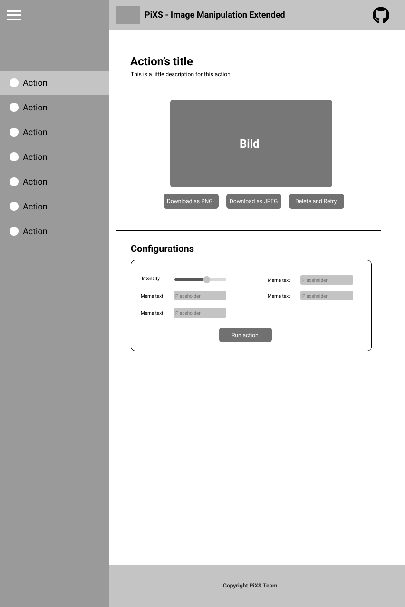
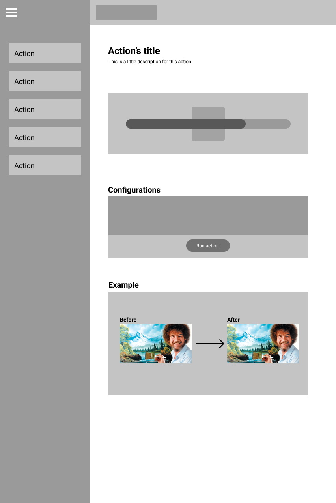

# 1 Convert to low poly

Uploading an image

## 1.1 Brief Description

One functionality of our software is to convert images to a low polygon version of itself. This not necessarily mean to decrease the resulution of an image but instead break down the image into many little triangles and recoloring them. This action needs some very timeintensive calculations and therefore can take a while before finishing. The number of triangles can be adjusted by the user.

# 2 Flow of Events

## 2.1 Basic Flow

- The user uploads an image to the server.
- The user chooses the convert to low poly action.
- The user adjusts the configurations as required.
- A progress bar indicates that the image is processed.
- The server checks if the image is in png file format.
- If not, the server will convert the image to png before proceeding with the routine.
- On success of the routine, the progress bar will disappear and the processed image will be displayed to the user. The user can then decide wheter he wants to download the processed images or wants to continue  editing.
- On failure, an warning will be shown to the user, the server will log the error and the user can upload a new image or try again.

### 2.1.1 Activity Diagram

### 2.1.2 Mock-up

### 2.1.3 Narrative

(n/a)

## 2.2 Alternative Flows

(n/a)

# 3 Special Requirements

(n/a)

# 4 Preconditions

## 4.1 Login

The user has to be logged in to the system.

# 5 Postconditions

(n/a)

# 6 Extension Points

(n/a)
