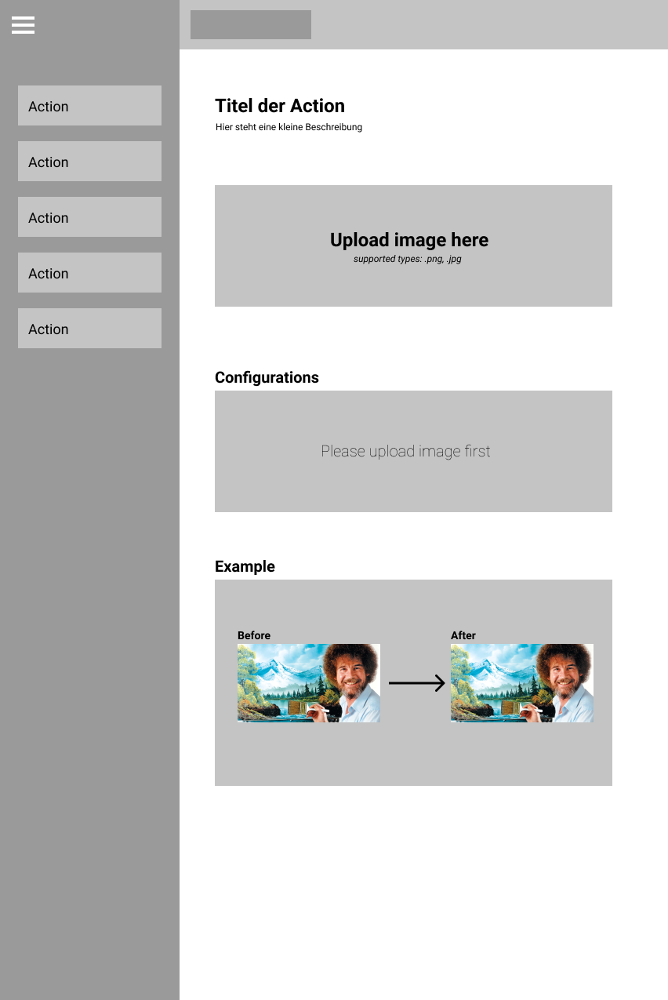
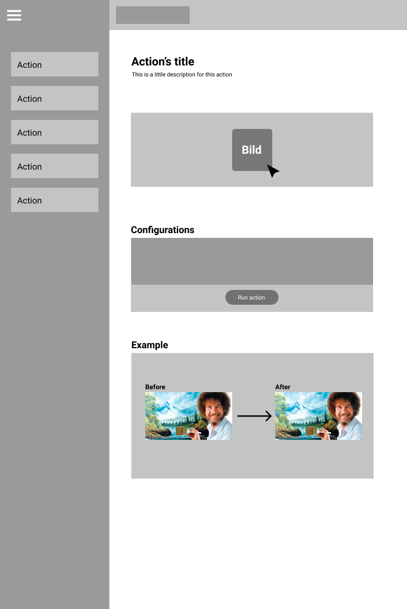

# 1 Upload image

Uploading an image

## 1.1 Brief Description

Every user can needs to upload an image before using our software. Therefore, this step is essential in the whole process of manipulating images with our software. The image which should be uploaded needs to be in `JPEG` or `PNG` format for the upload to work. The uploaded images aren't saved in a database or similar technologies.

# 2 Flow of Events

## 2.1 Basic Flow

- The user chooses an action for manipulating images.
- The user drags image onto an input field and drops it there.
- A progress bar indicates that the image is uploaded. The image is, therefore, uploaded to the server.
- The server checks if the image is in the right file format.
- On success, the user can start manipulating images
- On failure, the user can repeat the whole process again

### 2.1.1 Activity Diagram

### 2.1.2 Mock-up

### 2.1.3 Narrative

(n/a)

## 2.2 Alternative Flows

(n/a)

# 3 Special Requirements

(n/a)

# 4 Preconditions

## 4.1 Login

The user has to be logged in to the system.

# 5 Postconditions

(n/a)

# 6 Extension Points

(n/a)
